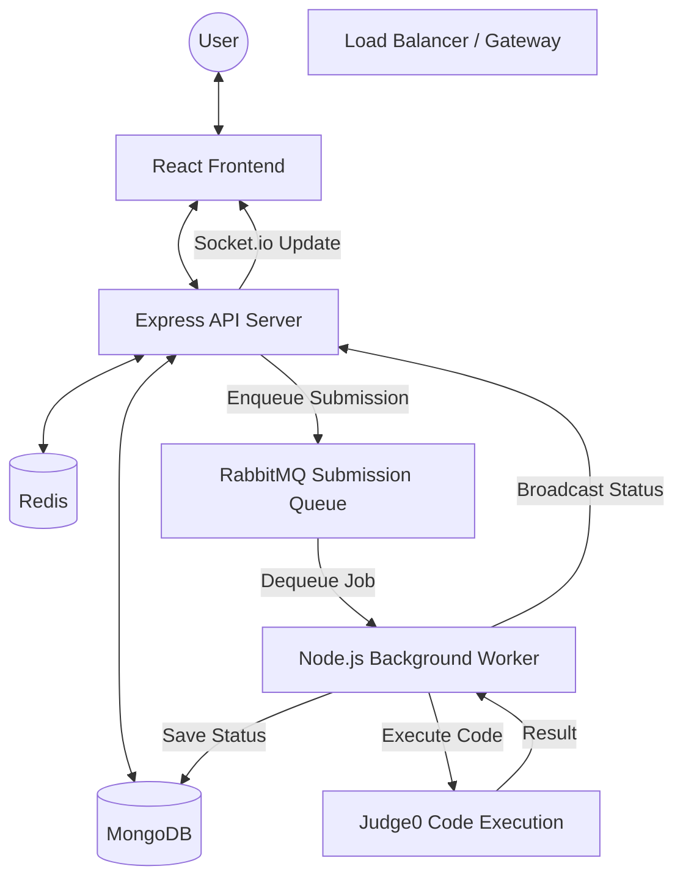

# HMP OJ — Engineering Overview
Deep dive into design, architecture, workflows, and core engineering decisions of a production-grade Online Judge.

## 🏗️ System Overview
**HMP OJ** (Heavily Modern Programming Online Judge) is not just a coding platform—it is a high-performance, scalable engine designed to handle the rigorous demands of competitive programming. Inspired by industry standards like LeetCode and Codeforces, HMP OJ leverages an **Event-Driven Architecture** to ensure that high-concurrency code submissions never compromise system stability.

The platform is engineered to decouple the "Acceptance" of code from its "Execution". By utilizing a distributed message broker (RabbitMQ) and a dedicated worker pool, HMP OJ can process hundreds of submissions simultaneously while maintaining a lightning-fast responsive UI for users.

---

## 🚀 Features
- **Real-Time Code Execution**: Support for multiple languages (C++, Java, Python, JavaScript) via Judge0 integration.
- **Async Judging**: Submissions are handled in the background, preventing API timeouts and ensuring reliability.
- **Dynamic Leaderboard**: Real-time ranking updates with efficient Redis-based caching.
- **Codeforces-Style Contests**: Timed, real-time coding arenas featuring dynamic score decay based on elapsed minutes and flat penalties for wrong attempts.
- **Interactive Discuss Section**: Integrated blogs and discussion forums for community engagement.
- **Robust RBAC**: Role-based access control for Admins (problem management) and Users (solving problems).
- **Dark Mode UI**: A premium, modern dashboard built with Tailwind CSS for enhanced developer experience.
- **Real-Time Notifications**: Live updates on submission status and chat via WebSockets.

---

## 🛠️ Tech Stack : What & Why
Every technology in HMP OJ was chosen to solve specific engineering challenges related to performance and concurrency.

| Technology | Role | Why? |
| :--- | :--- | :--- |
| **React + Vite** | Frontend Framework | Provides a reactive UI with ultra-fast hot-reloading and optimized production builds. |
| **Node.js (Express)** | Backend Core | Non-blocking I/O is perfect for handling high-frequency API requests and WebSocket connections. |
| **MongoDB (Mongoose)** | Primary Database | Flexible schema allows for evolving problem types and complex nested submission data. |
| **RabbitMQ** | Message Broker | The backbone of our event-driven system; ensures no submission is lost and decouples heavy judging from the API. |
| **Redis** | High-Speed Cache | Speeds up the Leaderboard and maintains real-time chat state with sub-millisecond latency. |
| **Socket.io** | Real-Time Sync | Powers the "live" feel—updating submission statuses and chat messages instantly. |
| **Judge0 API** | Execution Engine | Provides a secure, sandboxed environment for running untrusted user code across 50+ languages. |
| **Docker** | Containerization | Guarantees "it works on my machine" by orchestrating Mongo, Redis, and RabbitMQ in a unified environment. |

---

## 📐 High-Level Design (HLD)

---

## 🔄 System Flows

### 1. The Submission Lifecycle (Async Pipeline)
This is the most critical flow in the system, designed for high-throughput.

1. **Submission**: User writes C++ code and hits "Submit".
2. **Ingestion**: The Express API validates the request, creates a "Pending" record in MongoDB, and pushes a Job JSON into the `SUBMISSION_QUEUE` in RabbitMQ.
3. **Acknowledgment**: The API immediately returns a `202 Accepted` response to the user.
4. **Processing**: The **Background Worker** (consuming at its own pace) picks up the job.
5. **Execution**: The Worker calls Judge0 with the source code and paired test cases.
6. **Resolution**: Once Judge0 returns "Accepted" or "Wrong Answer", the Worker updates the MongoDB record and publishes an event.
7. **Notification**: Socket.io pushes a "Submission Completed" event to the user's browser, updating the UI dynamically.

### 2. Real-Time Leaderboard Flow
1. **Query**: User opens the Leaderboard.
2. **Cache Check**: The system first checks **Redis** for the pre-computed ranking.
3. **Cache Hit**: If present, returned in <1ms.
4. **Cache Miss**: If absent, the system queries **MongoDB** (Aggregating points across solved problems), saves the result to Redis with a TTL, and returns it.

---

## 🗄️ Database Design
HMP OJ uses a document-oriented approach to manage complex relationships between users and their coding history.

- **User**: Stores profile, salted passwords (bcrypt), points, and a history of solved problem IDs.
- **Problem**: Contains problem statements, difficulty (Easy/Med/Hard), time/memory limits, and references to test cases.
- **Contest**: Tracks specialized, timed competitive arenas alongside customized mapping of problem base points and active participants.
- **Submission**: A detailed log of every code attempt, including source code, language, status, and execution time.
- **Blog**: Community posts with comments and upvotes.

---

## 🔍 Deep Dives

### ⚡ Event-Driven Decoupling
By offloading judging to RabbitMQ, we protected the system from **"Thundering Herd"** problems. If 1,000 users submit code simultaneously, the API server doesn't crash from CPU spikes; it simply fills the queue, and the workers process them as fast as possible.

### 🛡️ Secure Execution Sandbox
User-provided code is **untrusted**. We never run it directly on our host. By utilizing **Judge0**, the code executes inside a restricted container with strict resource limits (CPU/Memory/Time) and no network access, preventing any malicious attempts to compromise our infrastructure.

### 🏆 Collaborative Real-Time Chat
Beyond judging, HMP OJ features a real-time chat system powered by **Socket.io**. This uses a "Join/Leave" room pattern, allowing users to discuss strategies in real-time while working on the same set of problems.

### 🛡️ API Security: Zero-Trust Submission Design
The Backend does not trust any user-provided metadata for judging.
- **Identity**: `userId` is extracted from the JWT token at the API boundary, never from the body.
- **Integrity**: Source code is sanitized and sent via HTTPS to Judge0 with unique tokens.
- **Isolation**: Judge0 runs code in a network-less, memory-capped container to prevent host compromise.

### ⚔️ Time-Decay Scoring Engine
Contests utilize a specialized active Leaderboard. Because submissions happen asynchronously, global scoring rules had to be bypassed during active contests strictly within the `worker.js` thread. Points are dynamically calculated completely on the fly in an Aggregation Pipeline that:
1. Calculates minutes elapsed between the `startTime` and `submissionTime`.
2. Diminishes the `basePoints` linearly down to a hard floor of 30%.
3. Flattens out `50` points retrospectively for every `Wrong Answer` / `Runtime Error` submitted prior to hitting an `Accepted` resolution.

### 🗃️ Database Strategy
We use **MongoDB** for its schema-less flexibility, which is vital for:
1. **Polymorphic Problems**: Different problems having varied input formats/test cases.
2. **Result Blobs**: Storing execution logs, error messages, and profiling metrics without pre-defined columns.

### 📡 Real-Time State Sync
We use **Socket.io** to provide an "instantly alive" experience.
- When a submission is processed by the background worker, it doesn't just update the DB; it emits a `submissionResult` event to the specific client's room.
- This eliminates the need for the browser to poll the database, reducing server load significantly.

---

## 🖼️ Project Screenshots

*Real-time problem dashboard with syntax highlighting editor.*

*Redis-cached leaderboard ranking top coders.*

*Detailed submission history with Judge0 feedback.*

---

## 🎥 Demo Video

*Watch HMP OJ in action: From submission to acceptance.*

---

## 🔮 Future Enhancements
- [ ] **Custom Docker Judge**: Moving from Judge0 API to a self-hosted Dockerized judge for even lower latency.
- [ ] **Plagiarism Detection**: Integrating MOSS (Measure Of Software Similarity) to detect code copying.
- [ ] **Redis RedLock**: Implementing distributed locking to handle concurrent contest registrations safely.

---

## 📬 Feedback & Contact
We are always looking for ways to improve HMP OJ. If you have suggestions, architectural questions, or want to contribute to the engine, reach out to us:

- **GitHub Issues**: Submissions and bug reports are welcome via the repository.

- **Email**: `subratshakya20@gmail.com`

---
*HMP OJ is open-source and built for the community. For technical queries, open an issue in the repository.*
